# Rust Ray Tracer

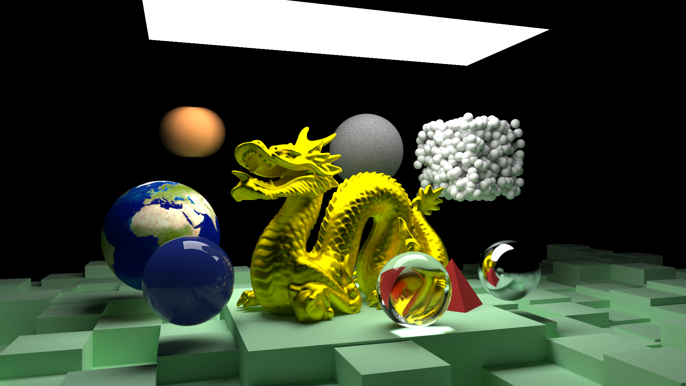

I have been interested in the mathematics behind ray tracing ever since I
studied some of the basic principles in college. A while back when I started
getting into Rust I was looking for a good project to test my skills. Given
Rust's excellent performance and zero-cost abstractions building a ray tracing
engine seemed like a great candidate. This project is the product of that
curiosity. Above is a look at the latest render from the project.

## Progression
Below are some examples of the progression of the ray tracer as features
were added over time.

First object, spheres.

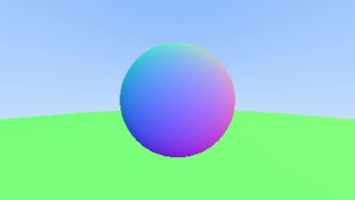

Adding a diffuse (matte) material.

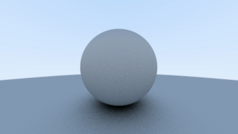

Adding a reflective material. Notice the left and right balls reflecting their
surroundings.

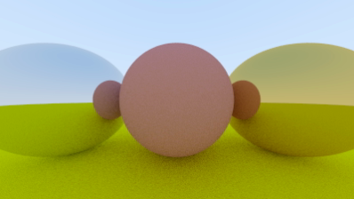

Adding a dielectric (transparent) material. Notice the left sphere is now
transparent.

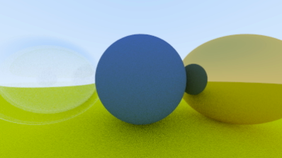

Adding more complexity.

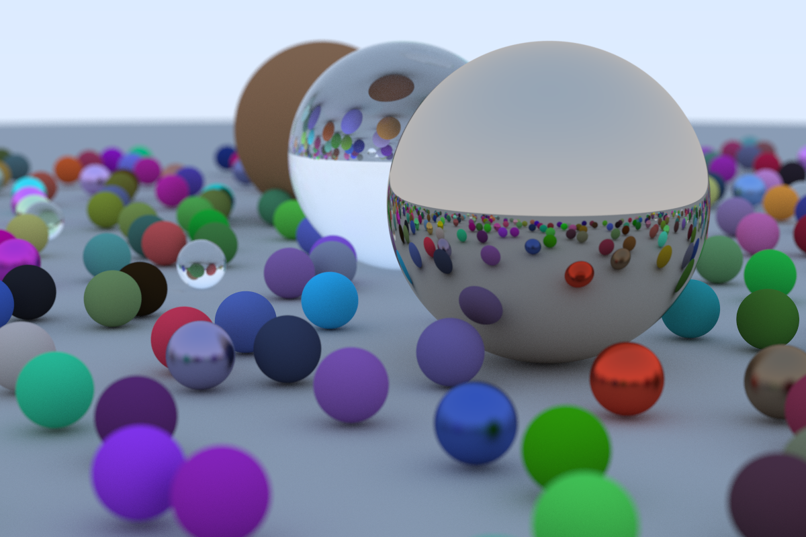

Adding motion blur, the spheres are now moving.

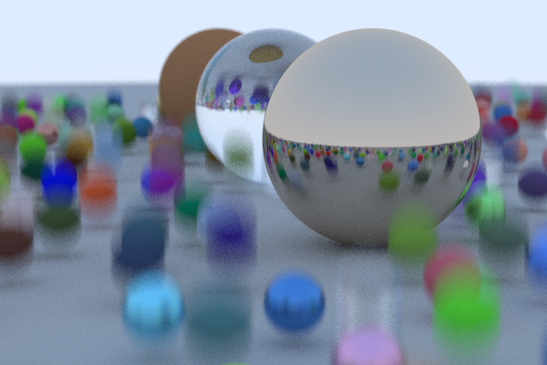

Adding textures. Textures allow us to vary the colour of an object across it's
surface, as shown by the checker pattern.

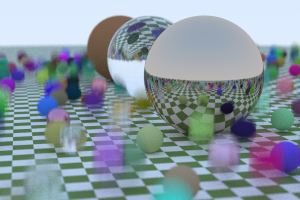

Adding image textures.

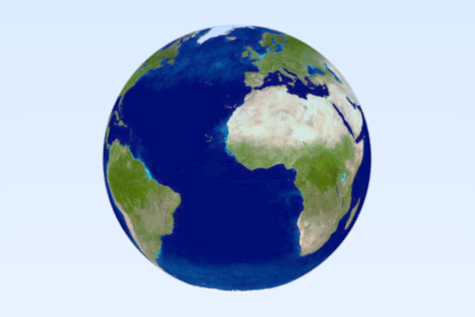

Adding rectangles, translation, rotation and implementing the famous [Cornell
Box](https://en.wikipedia.org/wiki/Cornell_box). The extra grain here is because
there is now much less light entering the scene, this can be solved by taking
more samples for each pixel.

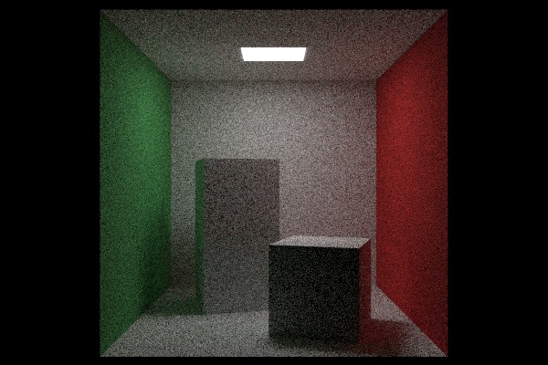

Adding triangles.

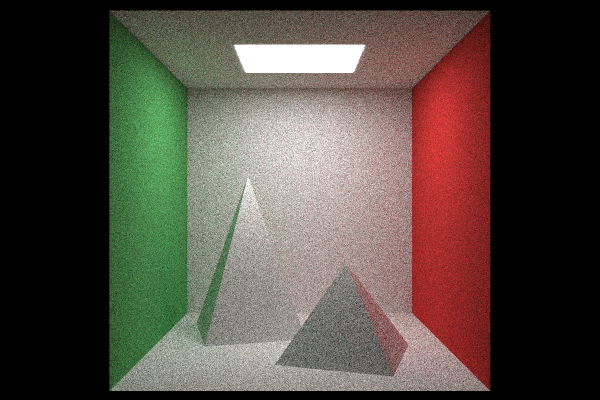

Adding the ability to read PLY files.

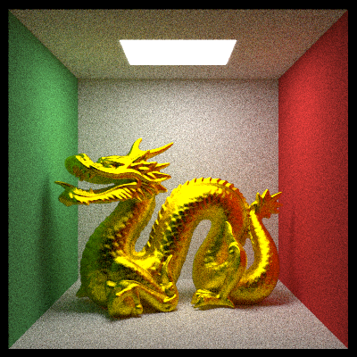

Putting it all together.

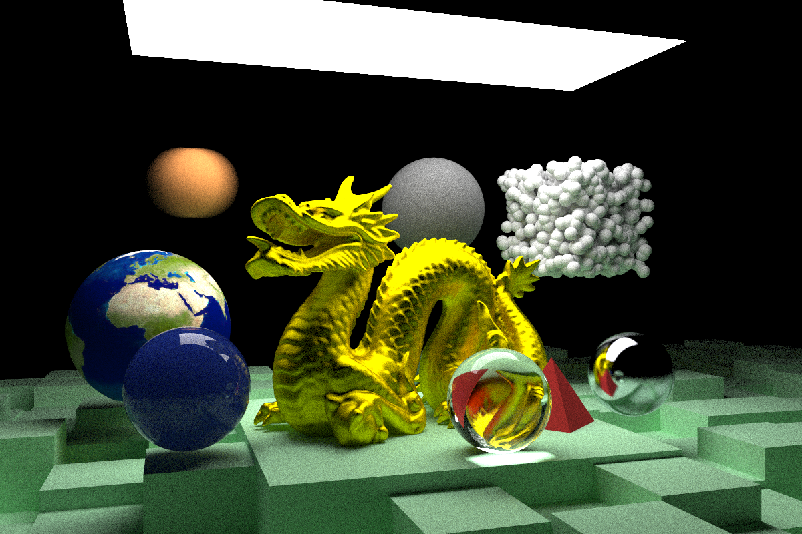

## What is a ray tracing engine?
Ray tracing is a method for producing computer generated images. It renders
images by simulating real light rays. It works by firing out light rays for each
pixel that is being rendered and bouncing them around the objects and light
sources in the scene. It then uses the data gathered by each light ray to
determine the colour of each pixel.

Ray tracing typically outperforms more traditional rendering methods on visual
fidelity. For example, notice the inverted image of the dragon seen through the
glass ball in the above image, this is something that is very difficult to
achieve with traditional rendering. The main downside is that ray tracing
involves a lot more compute so is much slower than traditional methods.

## What is this based on?
I based my ray tracing implementation on the Book Series "Ray Tracing In One
Weekend" by P. Shirley, T. Black, and S. Hollasch
(https://raytracing.github.io/). The implementation in the book is written in
C++ so a large portion of the work involved here was translating that code into
Rust. I certainly learnt a lot about the Rust borrow checker in this process!

I have just finished the second book in this three part series. I hope to move
onto the third book some time soon.

## Extras
The book is quite limited in scope to just the rendering logic involved in ray
tracing, as such I made several "nice to have" additions to my implementation;

- **Multi-threading:** Ray tracing is inherently suited to parallelisation as
  each pixel in a render can be computed in parallel, it is also completely CPU
  bound and very compute intensive. I added multi-threading via the
  [Rayon](https://github.com/rayon-rs/rayon) crate. Rayon's [work
  stealing](https://github.com/rayon-rs/rayon/blob/main/FAQ.md#how-does-rayon-balance-work-between-threads)
  technique is particularly well suited to ray tracing as certain groups of
  pixels tend to involve a lot more computation than others (for example pixels
  that involve reflective objects are much more intensive than those just
  looking at the sky). This was surprisingly easy to implement, it seems Rust
  really is good at multi-threading. After implementing this the time it took to
  complete my most intensive render went from a little over 2 hours to about 30
  mins on my 8 core CPU.
- **Triangles:** Most 3D models are made up of triangles so implementing the
  code necessary to compute ray intersections with triangles was an obvious
  choice. I used the [Möller–Trumbore intersection
  algorithm](https://en.wikipedia.org/wiki/M%C3%B6ller%E2%80%93Trumbore_intersection_algorithm).
- **PLY files:** PLY files are a common file format for 3D models. The dragon in
  the header image is such a model.
- **PNG output:** The book only covers outputting images in the PPM format (a
  text file with each pixel represented by three numbers). This is not a very
  widely supported image format so I brought in the
  [image](https://github.com/image-rs/image) crate to convert the images to PNG
  format. The crate enables you to feed in raw pixel data and then convert it to
  a variety of image formats.
- **Multi-camera support:** I added support for rendering a scene from multiple
  cameras/view points. Not much to say here other than it was something I was
  curious about, I also found it helpful for playing with the different camera
  parameters to see what they do.
