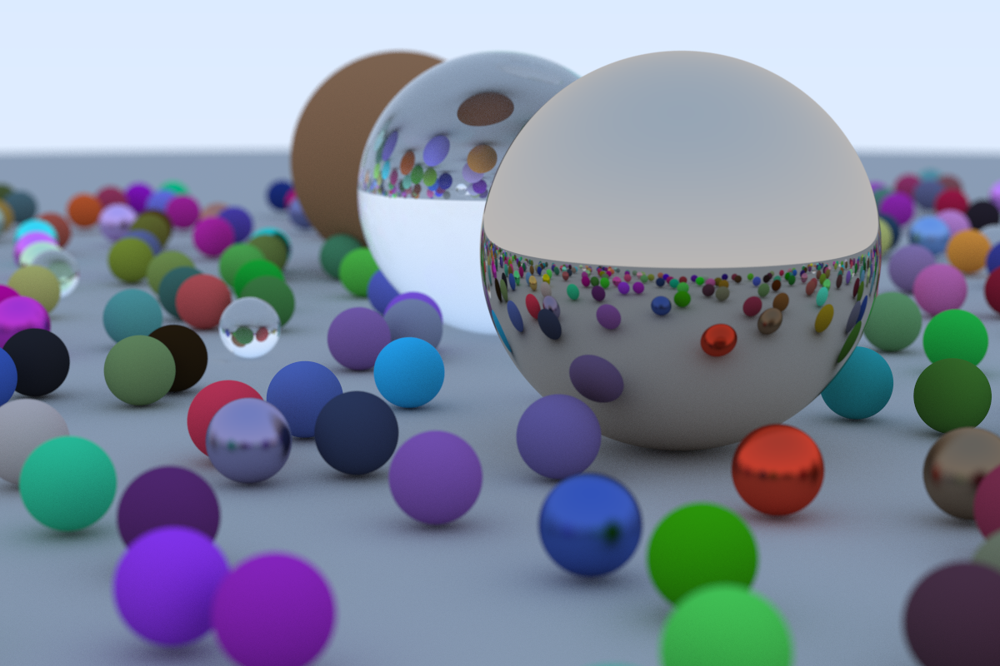

# Rust Ray Tracer

This is a simple CPU ray tracing implementation written in Rust. The
implementation is based on the book 'Ray Tracing In One Weekend' by P. Shirley,
T. Black, and S. Hollasch (https://raytracing.github.io/). The implementation in
the book is written in C++ so a large portion of the work involved here was
translating this into Rust.

I have always been interested in the mathematics behind ray tracing and studied
some of the basic principles in college. This was a fun project to explore some
of those ideas in greater detail and implement them in code. I have also been
spending some time learning Rust recently so it was a natural choice  for this
project given it's high performance and zero-cost abstractions.

Below is a look at the latest render from the project.

