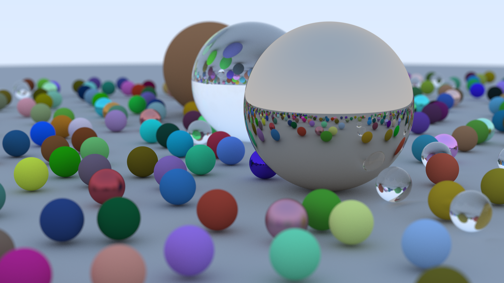

# Rust Ray Tracer

This is a simple CPU ray tracing implementation written in Rust. The
implementation is based on the book "Ray Tracing In One Weekend" by P. Shirley,
T. Black, and S. Hollasch (https://raytracing.github.io/). The implementation in
the book is written in C++ so a large portion of the work involved here was
translating this into Rust.

Above is a look at the latest render from the project, other renders can be
found in the [/historic_results](/historic_results) folder.

I have always been interested in the mathematics behind ray tracing and studied
some of the basic principles in college. This was a fun project to explore some
of those ideas in greater detail and implement them in code. I have also been
spending some time learning Rust recently so it was a natural choice  for this
project given it's high performance and zero-cost abstractions.

The book is quite limited in scope to just the rendering logic involved in ray
tracing, as such I made several "nice to have" additions to my implementation;

- **Multi-threading:** Ray tracing is inherently suited to parallelisation as
  each pixel in a render can be computed in parallel, it is also completely CPU
  bound and very compute intensive. I added multi-threading via the
  [Rayon](https://github.com/rayon-rs/rayon) crate. Rayon's [work
  stealing](https://github.com/rayon-rs/rayon/blob/main/FAQ.md#how-does-rayon-balance-work-between-threads)
  technique is particularly well suited to ray tracing as certain groups of
  pixels tend to involve a lot more computation than others (for example pixels
  that involve reflective objects are much more intensive than those just
  looking at the sky). This was surprisingly easy to implement, it seems Rust
  really is good at multi-threading. After implementing this the time it took to
  complete my most intensive render went from a little over 2 hours to about 30
  mins on my 8 core CPU.
- **PNG output:** The book only covers outputting images in the PPM format (a
  text file with each pixel represented by three numbers). This is not a very
  widely supported image format so I brought in the
  [image](https://github.com/image-rs/image) crate to convert the images to PNG
  format. The crate enables you to feed in raw pixel data and then convert it to
  a variety of image formats.
- **Multi-camera support:** I added support for rendering a scene from multiple
  cameras/view points. Not much to say here other than it was something I was
  curious about, I also found it helpful for playing with the different camera
  parameters to see what they do.
